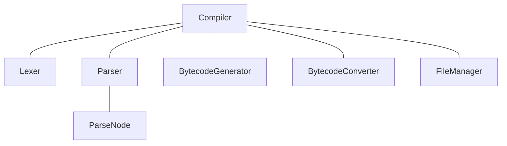

# MCLang development

This document gives an overview of different aspects of the `MCLang` application.

## Build instructions

To build the project on Linux, run `make` inside the project folder. The output program will be at `build/main`. Use `build/main -h` to show help for how to use the program.

## Project structure

The `mclang` folder contains all of the components of the compiler. Each of these components can then interact with each other. The main component is the `Compiler` component, which interacts with all other components. Through the `Compiler` component, all other components can communicate with each other as well.

This communication is achieved by passing a pointer to the `Compiler` component to each of the direct subcomponents. The `Compiler` component in turn also has pointers stored to the direct subcomponents. A *forward declaration* has to be used to achieve this.

### Lexer

The lexer converts input text to tokens. For example, some of the tokens are `{`, `(`, strings, words, etc.

### Parser

The parser converts a list of tokens to a parse tree, which contains parse nodes which link to each other. Each parse node has `bytecode` as a member function, which is used to convert the code, with all of the information stored in it, to bytecode.

### Bytecode generator

The bytecode generator is a component that handles the conversion of a parse tree to bytecode. The actual conversion is done in the parse nodes, not in this component.

### Bytecode converter

The bytecode converter converts bytecode to minecraft commands.

### File manager

The file manager is used to build the datapack structure (folders, required files) and to output the minecraft commands generated by the bytecode converter to actual files inside the output datapack.

## GitHub development

To prevent issues with compatibility and corrupted code, separate branches are used when changing *any* code. In general, one branch is made per open issue, if the issue is being worked on. The branch is deleted after the branch has merged with `main`. A merge with `main` can only happen once a pull request is made, accepted, and passes *all* of the tests, which are run automatically when a pull request to `main` is made.

## Tests

Tests are located in the `tests` folder. Note that to execute any test the GitHub Actions CI files need to be changed. One of the tests checks if all of the examples in the `examples` folder (which do not contain `"invalid"`) can be compiled without errors. The GitHub Actions CI also builds the project separately from executing these tests.
