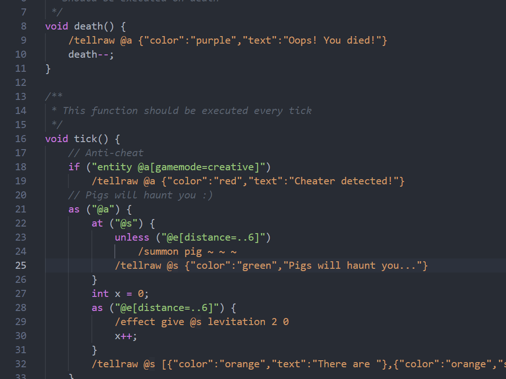

# MCLang Syntax

MCLang is a custom language currently in development used to convert code to minecraft datapacks. This extension is used to add syntax highlighting to Visual Studio Code for `.mcl` and `.mclang` files.

For the MCLang package, see the [GitHub page](https://github.com/PurpleStripedUnicorn/MCLang).